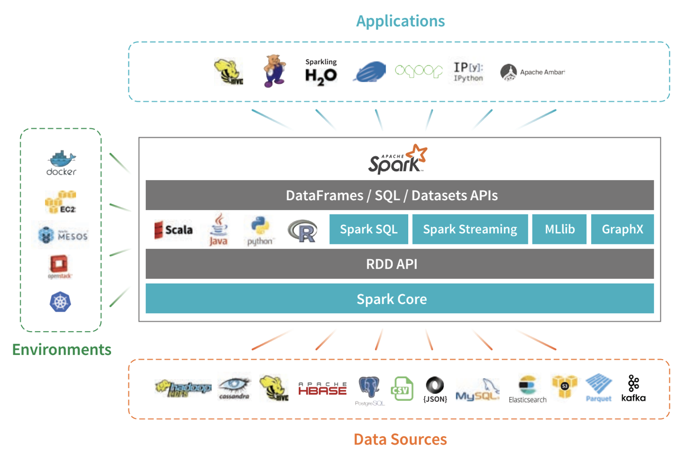

<header>

# Introduction to Apache Spark

</header>

## History of Big Data:


## Sparks' History:

* Developed by Mataei Zaharia
* 2009 - UC Berkely Amplabs
* 2010 - Open sourced - BSD licence
* 2013 - Donated to Apache Software Foundation
* 2014 - Become top level Apache Project 
* Founded the company Databricks

## What is Spark:

* Defined as fast, general purpose, distributed computing platform
* Unified analytical engine for large scale data processing
* Provides high level API in Java | Scala | Python | R languages
* Support high level tools
  * SparkSQL - SQL | Structured data processing
  * MLib - Machine learning
  * GraphX - Graph processing
  * Structured processing - Stream processing
* written in Scala - Functional programming language that runs in a JVM
* Spark shell - interactive for learning, data exploration or ad hoc analytics avaliable in Python and Scala
* Spark Application - for large scale data processing avaliable in Python | Java and Scala
* Distributed processing framework
* Used for both batch and interactive
* DAG
* Query optimizer

## Why Spark:

1. Open source
2. Ease of use
3. Fast (in memory)
4. No boiler plate code (consise code) - High productivity
5. Wide support - Databricks | Cloudera | MapR | IBM
6. Support for multiple language - Java | R | Python | Scala | SQL
7. Fault tolerance
8. Lazy evaluation
9. Stream processing
10. Integrate with Hadoop | NoSQL | Kafka etc.
11. Unified framework for scalable DS, scalable ML, microbatch
12. Deployment - Mesos | YARN | Kubernetes | own cluster manager
13. Immutable - RDD
14. REPL - Read Evaluate Print Loop
15. Interactive shell (Pyspark | Spark-shell)
16. Scalability
17. Great for Iterative algoriths (ML works on same data)
18. Good for joining datasets

## Spark Ecosystem:



## Spark Logical Architecture:


* Unified Architecture
* Benefit of stack - Changes in core - inherit above

1. ### Spark Core
* Heart of the Spark framework
* Provide execution engine
* Inbult memory computing
* Responsible to perform I/O function
* Task Scheduling
* Monitoring
* Distribution
* Fault Recovery
* Memory management

2. ### SparkSQL
* Provide support for structured data
* Allow query the data via sQL
* Integrated - Seamlessly mix SQL query with Spark programs
* Uniform data access - connect to any data source in the same way
* Hive integration - run SQL or HSQL queries
* Connnect through JDBC or  ODBC

3. ### Dataframe
* Abstraction for SparkSQL
* Distributed colleciton of data ordered into named column
* Catalyst - extensible optimizer | optimization framework to improve productivity and performance of queries
* Concept of dataset

4. ### MLib
* Support various ML algorithms
* Approx 10x faster than Mahout
* Can be called from Java | Scala | Python
* Scalable ML
* Easily integrate with other tools | framework

4. ### GraphX
* Graph computation engine
* Similar to tools like Neo4J, Girage
* Used for graphical computations
* Directed graph - vertex | edges concepts
* Support various algorithms - PageRank | Connected Components | Traingle Counting
* Support operations like subgraph | Join vertices | aggregates messages

5. ### Structured Streaming:
* Near real-time processing
* Continous Streaming model
* Structured Streaming API (2.x above)
* DStream API (1.x version)
* View stream as continous growing table

## Spark Use Cases:
* Scalable ETL
* Stream processing 
* ML
* Data integration
* Interactive Analysis
* Iterative algorithm
* Social graph process
* Real-time fraud detection
* Recommendation engine
* Customer segmentation

## Spark Real World Use Cases:
* Uber
* Pinterest
* eBay
* Alibaba
* Netflix
* Trip Advisor

## Spark Shell:
* Provide interactive data exploration (REPL)
* It is a Spark application written in Scala
* Offer command line environment with auto-completion
* Run ad hoc queries
* Shell
  * Python - Pyspark
  * Scala - Spark-shell
* Automatic initialization of Spark session (spark) and Spark context (sc)
* Tool to analyse data interactively

## Spark Context:
* Main Entry point to Spark functionality
* Represent the connection to Spark cluster
* Get the current status of the Spark application
* Set configuration
* Pre-configured variable in the shell (sc)
* In the application we need to create (sc)
* Used to create RDD | Broadcast variable | Accumulator
* It was used before version 2.0

## SQLContext:
* Entry point to Spark SQL
* Can perform SQL-like operations on Dataframe and Dataset
  
## SparkSession:
* Introduced in 2.0
* Main Entry point to Spark functionality to create
  * RDD
  * Dataframe
  * Datasets
* Default available in a shell - a variable with name (spark)
* In the application we need to create using the SparkSession builder pattern
```
# Python code
# The entry point into all functionality in Spark is the SparkSession class.
# To create a basic SparkSession, just use SparkSession.builder

from pyspark.sql import SparkSession

spark = SparkSession \
    .builder \
    .appName("Python Spark SQL basic example") \
    .config("spark.some.config.option", "some-value") \
    .getOrCreate()
```
* 1-1 relationship between SparkSession and Spark application
* Replace with SQLContext | HiveContext (used prior to 2.0)

