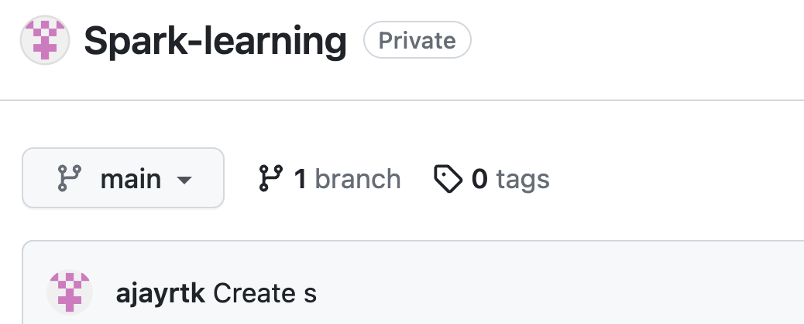

<header>

# Kubernetes Service
A Kubernetes Service is an abstraction layer that defines a logical set of Pods and enables external traffic exposure, load balancing, and service discovery for those Pods.

Service is a method for exposing a network application that is running as one or more Pods in your cluster.
</header>

## Why Service is needed:

1. Each Pod gets its own IP address, however, in deployment, the set of Pods running in one moment in time could be different from the set of Pods running that application a moment later.
2. This leads to a problem: if some set of Pods (**backends**) provides functionality to other Pods (**frontends**) inside your cluster, how do the frontends find out and keep track of which IP address to connect to, so that the frontend can use the backend part of the workload.
3. When using Replication Controller, Pods are terminated and created during scaling or replication operation.
4. When using deployment while updating the image version, the Pods are terminated and new Pods take the place of other Pods.
5. Pods are very dynamic that i.e. they come and go on the Kubernetes cluster and on any of the available nodes and it would be difficult to   access the Pods as the Pods IP address changes once it is recreated.



## Service Object:
1. The Service API, part of Kubernetes, is an abstraction to help you expose groups of Pods over a network.
2. Service object is a logical bridge between Pods and the end user which provide a Virtual IP(VIP).
3. Services allow a client to reliably connect to the container running in the pod using the VIP.
4. The IP is not an actual IP connected to a network but its purpose is purely to forward traffic interface to one or more pods.
5. Kubeproxy keeps the mapping between VIP and Pods up to date, which queries the API server to learn about new services in the cluster.

```
apiVersion: v1
kind: Service
metadata:
  name: my-service
spec:
  selector:
    name: MyApp
  ports:
    - protocol: TCP
      port: 80
      targetPort: 9376
```

Although each Pod has a unique IP address, those IPs are not exposed outside the cluster without a Service. 

Services allow your applications to receive traffic. 

Labels are used to select which Pods to put under a service.

Creating a service will create an endpoint to access the Pods/application in it.

Services can be exposed in different ways by specifying a type in the spec of the Service:

1. **ClusterIP** (default) - Exposes VIP only reachable from within the cluster. Mainly used to communicate between components of Microservices. This type makes the Service only reachable from within the cluster.
```
vi deployhttpd.yaml (Deployment)
```
2. **NodePort** -Exposes the Service on the same port of each selected Node in the cluster using NAT. Makes a Service accessible from outside the cluster using <NodeIP>:<NodePort>. Superset of ClusterIP.
```
apiVersion: v1
kind: Service
metadata:
  name: my-service
spec:
  type: NodePort
  selector:
    app.kubernetes.io/name: MyApp
  ports:
      # By default and for convenience, the `targetPort` is set to the same value as the `port` field.
    - port: 80
      targetPort: 80
      # Optional field
      # By default and for convenience, the Kubernetes control plane will allocate a port from a range (default: 30000-32767)
      nodePort: 30007
  ```
3. **LoadBalancer** - Creates an external load balancer in the cloud and assigns a fixed, external IP to the Service. Superset of NodePort. (ELB on AWS).
```
apiVersion: v1
kind: Service
metadata:
  name: my-service
spec:
  selector:
    app.kubernetes.io/name: MyApp
  ports:
    - protocol: TCP
      port: 80
      targetPort: 9376
  clusterIP: 10.0.171.239
  type: LoadBalancer
status:
  loadBalancer:
    ingress:
    - ip: 192.0.2.127
```
4. **ExternalName** - Maps the Service to the contents of the externalName field (e.g. api.foo.bar.example). Create several endpoints that are used to produce DNS records. Each DNS record is based on a Pod.
   


## Step 1: Enable GitHub Pages

_Welcome to GitHub Pages and Jekyll :tada:!_

The first step is to enable GitHub Pages on this [repository](https://docs.github.com/en/get-started/quickstart/github-glossary#repository). When you enable GitHub Pages on a repository, GitHub takes the content that's on the main branch and publishes a website based on its contents.

### :keyboard: Activity: Enable GitHub Pages

1. Open a new browser tab, and work on the steps in your second tab while you read the instructions in this tab.
1. Under your repository name, click **Settings**.
1. Click **Pages** in the **Code and automation** section.
1. Ensure "Deploy from a branch" is selected from the **Source** drop-down menu, and then select `main` from the **Branch** drop-down menu.
1. Click the **Save** button.
1. Wait about _one minute_ then refresh this page (the one you're following instructions from). [GitHub Actions](https://docs.github.com/en/actions) will automatically update to the next step.
   > Turning on GitHub Pages creates a deployment of your repository. GitHub Actions may take up to a minute to respond while waiting for the deployment. Future steps will be about 20 seconds; this step is slower.
   > **Note**: In the **Pages** of **Settings**, the **Visit site** button will appear at the top. Click the button to see your GitHub Pages site.

<footer>

<!--
  <<< Author notes: Footer >>>
  Add a link to get support, GitHub status page, code of conduct, license link.
-->

---

Get help: [Post in our discussion board](https://github.com/skills/.github/discussions) &bull; [Review the GitHub status page](https://www.githubstatus.com/)

&copy; 2023 GitHub &bull; [Code of Conduct](https://www.contributor-covenant.org/version/2/1/code_of_conduct/code_of_conduct.md) &bull; [MIT License](https://gh.io/mit)

</footer>
