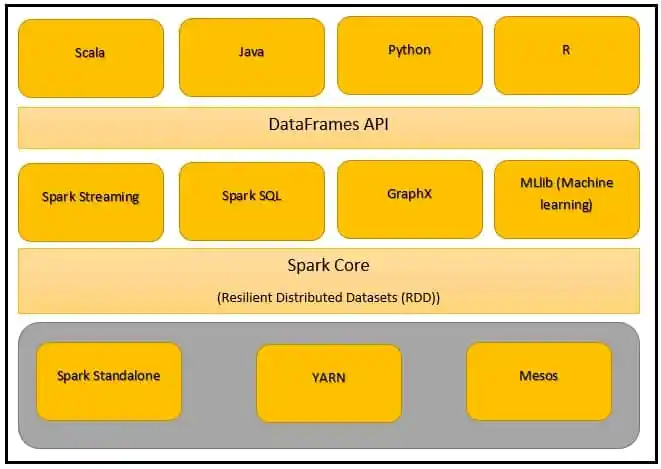

<header>

# Introduction to Apache Spark

</header>

## Spark Logical Architecture:

## Sparks' History:

* Developed by Mataei Zaharia
* 2009 - UC Berkely Amplabs
* 2010 - Open sourced - BSD licence
* 2013 - Donated to Apache Software Foundation
* 2014 - Become top level Apache Project 
* Founded the company Databricks

## What is Spark:

* Defined as fast, general purpose, distributed computing platform
* Unified analytical engine for large scale data processing
* Provides high level API in Java | Scala | Python | R languages
* Support high level tools
  * SparkSQL - SQL | Structured data processing
  * MLib - Machine learning
  * GraphX - Graph processing
  * Structured processing - Stream processing
* written in Scala - Functional programming language that runs in a JVM
* Spark shell - interactive for learning, data exploration or ad hoc analytics avaliable in Python and Scala
* Spark Application - for large scale data processing avaliable in Python | Java and Scala
* Distributed processing framework
* Used for both batch and interactive
* DAG
* Query optimizer

## Why Spark:

1. Open source
2. Ease of use
3. Fast (in memory)
4. No boiler plate code (consise code) - High productivity
5. Wide support - Databricks | Cloudera | MapR | IBM
6. Support for multiple language - Java | R | Python | Scala | SQL
7. Fault tolerance
8. Lazy evaluation
9. Stream processing
10. Integrate with Hadoop | NoSQL | Kafka etc.
11. Unified framework for scalable DS, scalable ML, microbatch
12. Deployment - Mesos | YARN | Kubernetes | own cluster manager
13. Immutable - RDD
14. REPL - Read Evaluate Print Loop
15. Interactive shell (Pyspark | Spark-shell)
16. Scalability
17. Great for Iterative algoriths (ML works on same data)
18. Good for joining datasets

## Spark Logical Architecture:

